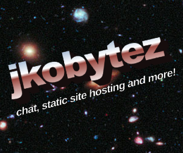

# jkobytez
some random shit, supposed to be a replacement for never released jkoportal, yeah

ironic how, jkoportal was supposed to be a replacement for dead neocities directory sites but that is dead so XDLO
## cool features lol
- static website hosting (html, css, js only, and under 75mb, due to limitations in the hosting plan, however if we get vps, this number will be increased)
- instant chat
- ad network (advertise your site for free)
- other comign soon
- cool domain (http://jkobytez.tk)
